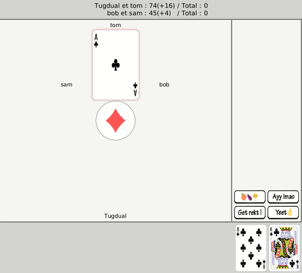

# Javass
EPFL Semester 2, Project 1 Coded in Java

---
## Project
Made to simulate a game of Jass between random players, monte carlo simulated players 
and you.

Multiplayer was implemented, as well as a protocol to communicate on player actions.
Extra points were scored in the implementation of a starting menu GUI, a voice chat,
clash of clans type emoji chat, animating the cards and implementing **voice commands**

---
## Gif

